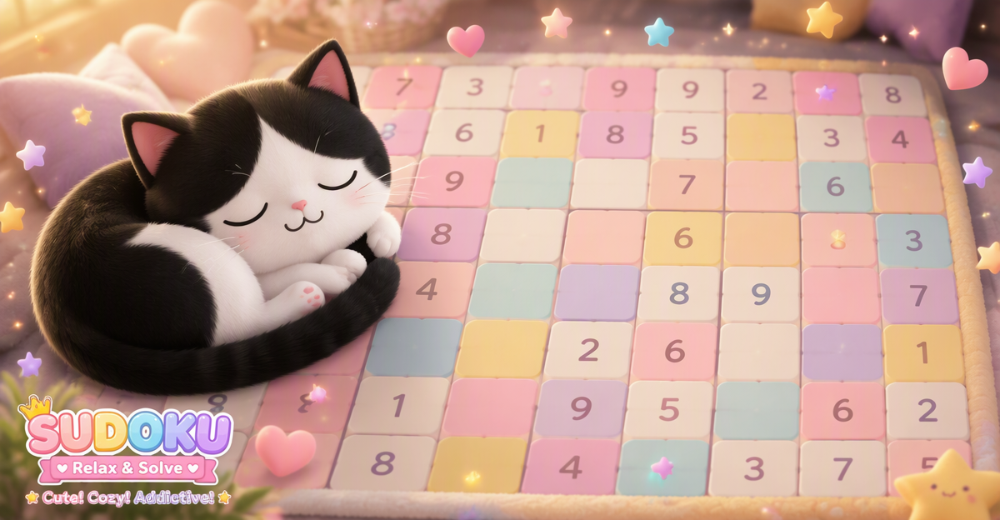
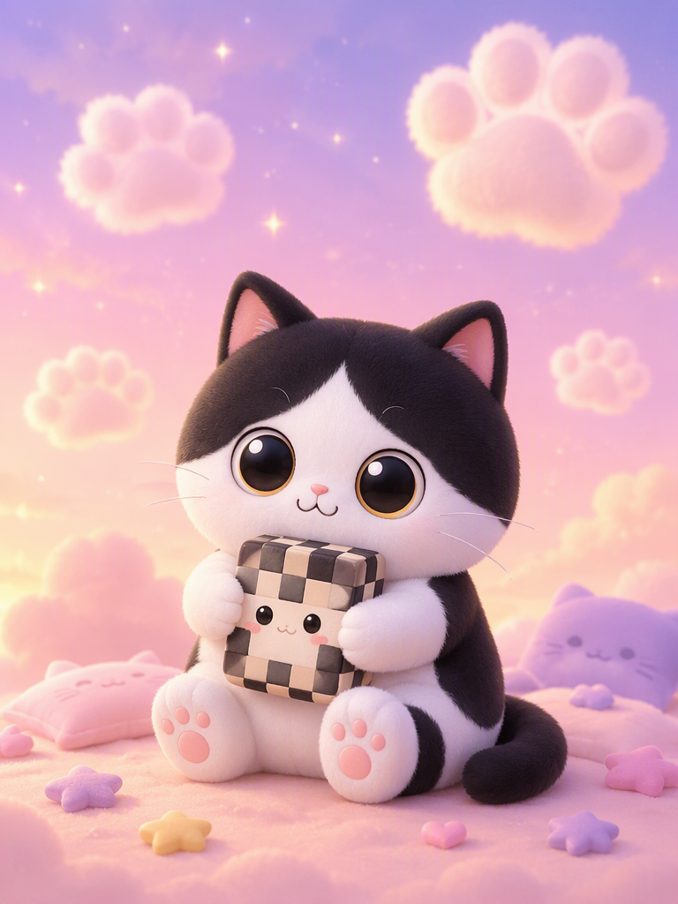
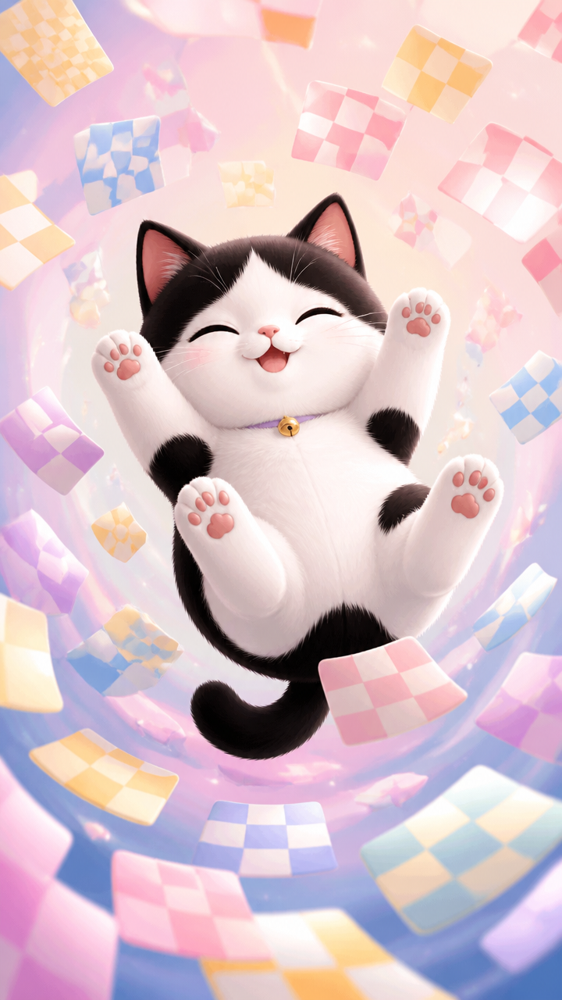

# Meowdoku 广告投放平面素材设计方案

> 哈米科技 · 广告设计笔试题 · 方向 B：投放广告平面素材

---

## 一、项目概述

**目标产品**：Meowdoku（猫猫数独）  
**产品类型**：萌系猫咪主题逻辑解谜手游，融合数独与扫雷双重推理玩法  
**创意方向**：「治愈系喵日常」—— 把烧脑的解谜变成和猫咪一起的治愈时光  
**核心洞察**：轻竞技的烧脑玩法 + 治愈系的萌猫陪伴 = 碎片化时间的最优解压选择

---

## 二、受众分析与创意决策

### 2.1 核心受众画像

| 维度 | 描述 |
|------|------|
| **主力人群** | 18-35 岁女性 |
| **心理诉求** | 解压、治愈、陪伴感、想证明自己"聪明但不费力" |
| **使用场景** | 通勤、午休、睡前碎片时间 |
| **审美偏好** | 马卡龙色系、萌系卡通、柔软蓬松的视觉质感 |

### 2.2 创意方向选择逻辑

在三个候选方向中，最终选定 **方向 C「治愈系喵日常」**，理由：

1. **受众覆盖最广**："治愈 + 萌"是休闲游戏广告中 CTR 最高的视觉类型，对女性主力受众吸引力最强
2. **与竞品趋势一致**：参考图中的 Perfect Tidy（治愈整理）和 Cookingo（治愈美食）均采用类似调性，验证该方向的市场有效性
3. **与产品气质匹配**：Meowdoku 的彩色马卡龙棋盘和圆润猫咪形象天然适合治愈系表达
4. **变体延展空间大**：慵懒、可爱、温暖的情感基调下，动作/表情/场景/道具四个维度都有丰富的创作空间

---

## 三、视觉规范

### 3.1 角色设定

基于产品实际画面中的奶牛猫形象，锁定以下特征：

- **品种**：黑白奶牛猫（Tuxedo Cat）
- **脸型**：白色圆脸打底，头顶有一大块黑色斑块（像戴了顶黑帽子）
- **眼睛**：超大圆眼，黑色瞳孔，金色/琥珀色虹膜
- **鼻子**： tiny 粉色小鼻子
- **嘴巴**：简洁的 "ω" 形微笑
- **风格**：萌系卡通 / kawaii / 治愈系

### 3.2 色彩系统

| 色块 | 用途 |
|------|------|
| 马卡龙粉 `#FFB6C1` | 主色，温柔治愈 |
| 奶油黄 `#FFF8DC` | 辅色，温暖明亮 |
| 天空蓝 `#87CEEB` | 辅色，清爽透气 |
| 薰衣草紫 `#E6E6FA` | 辅色，梦幻柔和 |
| 奶白色 `#FFFEF0` | 底色，干净明亮 |

### 3.3 光影氛围

- **光源**：柔和漫射光，无明显硬阴影
- **氛围**：温暖午后阳光感，像是周末和猫在一起的时光
- **情绪**：轻盈、蓬松、慵懒、治愈

---

## 四、交付物展示

### 主图创意（三尺寸）

| 横版 1200×627 | 竖版 768×1024 | 全屏 720×1280 |
|---|---|---|
|  |  |  |
---

## 五、参考图构图分析（只学骨架，不照搬）

详见 `references/构图骨架分析.md`，核心提取：

| 参考图 | 产品 | 学到的骨架 | 在本方案中的应用 |
|--------|------|-----------|-----------------|
| Perfect Tidy | 治愈整理 | 角色特写 + 周边物品陈列 | 横版主图的左侧角色 + 右侧棋盘满铺 |
| Cookingo | 治愈美食 | 角色占 1/3 + 彩色元素满铺 | 横版主图的构图比例和色彩满铺策略 |
| Talking Tom 2 | 动态冒险 | 动态动作 + CTA 按钮位置 | 全屏主图的猫打滚动态 + CTA 区域预留 |
| Wool Crush | 毛线消除 | 漂浮道具点缀 | 全屏主图的棋盘格子漂浮环绕手法 |

---

## 六、人机协作过程说明

### 6.1 协作分工

| 环节 | 我的决策 | AI 辅助 |
|------|---------|---------|
| 题目理解 | 确认方向 B，明确要求 | 逐条梳理验收清单 |
| 受众分析 | 拍板核心受众为 18-35 岁女性 | 提供数据分析框架 |
| 创意方向 | 选定「治愈系喵日常」 | 产出 3 个候选方案 |
| 角色设定 | 确认奶牛猫特征（基于产品截图） | 锁定 prompt 关键词 |
| 构图策略 | 融合 Perfect Tidy + Cookingo 骨架 | 提供参考图分析 |
| 出图迭代 | 每轮审美判断与反馈 | 执行生图、调整 prompt |
| 质量把关 | 终审通过/打回修改 | 按反馈重绘 |
| 文档撰写 | 确认逻辑与表达 | 生成初稿 |

### 6.2 AI 工具使用说明

- **生图工具**：使用文生图模型，通过精确 prompt 控制角色特征、色彩、构图
- **prompt 工程**：将产品截图中的猫形象转化为可复用的角色描述词，确保 7 张图角色一致性
- **迭代策略**：第一轮生成后发现问题（混入其他游戏文字），通过强化 "NO text" 指令修复
- **质量把控**：每轮生成后人工审查，不合格的立即打回重绘，不妥协

### 6.3 过程留痕

本仓库的 `process/` 文件夹包含完整的创作过程记录：
- `01-audience-analysis-and-creative-direction.md`：受众分析与创意定稿
- `02-main-creative-iteration-log.md`：主图迭代记录（含问题发现与修复）
- `03-variant-iteration-log.md`：变体图迭代记录

---

## 七、自检清单

### 7.1 题目硬性要求

- [x] 围绕奶牛猫主角展开创意
- [x] 一个创意出齐三尺寸：1200×627 / 768×1024 / 720×1280
- [x] 主角变体图不少于 4 张（动作/表情/场景/道具）
- [x] 参考 4 张竞品广告，只学构图骨架，未照搬内容
- [x] 用 Git 仓库提交，过程与结果同等重要

### 7.2 设计质量

- [x] 角色形象与产品实际画面一致（黑白奶牛猫、圆脸、黑顶、圆眼、粉鼻）
- [x] 三尺寸主图保持同一创意概念和视觉风格
- [x] 变体图覆盖四个不同维度，各有特色
- [x] 色彩系统统一（马卡龙色系）
- [x] 无侵权文字/Logo/品牌名

### 7.3 投放适配

- [x] 横版 1200×627 适合信息流横图位
- [x] 竖版 768×1024 适合卡片广告位
- [x] 全屏 720×1280 适合手机全屏广告位
- [x] 各尺寸预留 CTA 按钮区域

---

## 八、目录结构

```
meowdoku-ads-test/
├── README.md                           # 本文件
├── main-creatives/                     # 3 张主图
│   ├── main-01-1200x627.png           # 横版：猫睡棋盘
│   ├── main-02-768x1024.png           # 竖版：猫抱玩偶
│   └── main-03-720x1280.png           # 全屏：猫打滚
├── character-variants/               # 4 张变体图
│   ├── variant-01-action.png          # 动作：伸懒腰
│   ├── variant-02-expression.png    # 表情：wink
│   ├── variant-03-scene.png         # 场景：花环花园
│   └── variant-04-prop.png          # 道具：咖啡杯
├── references/                       # 参考分析
│   └── 构图骨架分析.md                # 4 张参考图构图拆解
└── process/                           # 过程记录
    ├── 01-audience-analysis-and-creative-direction.md
    ├── 02-main-creative-iteration-log.md
    └── 03-variant-iteration-log.md
```

---

## 九、联系与反馈

如有任何问题或需要补充说明，欢迎通过笔试题提交渠道联系。
